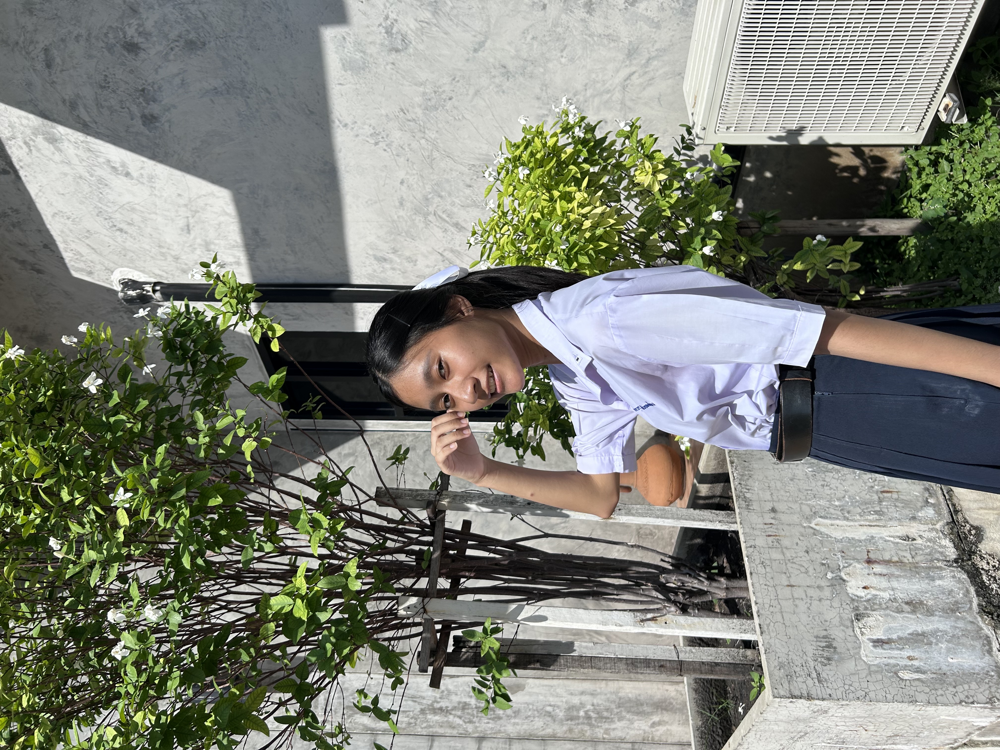

# แนะนำสมาชิกในทีม

## ข้อมูลส่วนตัว

ชื่อ : กนกวรรณ ห้วยหงษ์ทอง (Kanokwan Hoyhongthong)
ชื่อเล่น : มุก (Mook)
อายุ : 18 ปี
### งานอดิเรก 
- ชอบเล่นเกมแนวต่อสู้แบบFreefire แล้วก็เล่นชิวๆ พวกมายคราฟ คุกกี้รัน /ฟังเพลง
### ช่วงนี้ชีวิตในมหาวิทยาลัยเป็นอย่างไรบ้าง
- เปิดมาแล้ว 2 อาทิตย์ ก็ยังไม่ชินเท่าไหร่ ยังปรับตัวไม่ค่อยได้ โดยเฉพาะเรื่องเรียน มันไม่เหมือนกับมัธยมเลย แล้วยิ่งอยู่หอไม่ได้อยู่บ้าน พอเลิกเรียนกลับหอ ก็เหงาๆ คิดถึงบ้านมากกก ช่วงนี้ก็มีเครียดเรื่องคิดถึงบ้านนี่แหละ แต่คิดว่าเดี๋ยวจะเริ่มไม่มีเวลาคิดเรื่องอื่นละ นอกจากเรื่องงาน งานเย๊ออเยอะ ต้องรับผิดชอบเอาอ่ะ ไม่ได้มีใครคอยทวงแล้ว โดยรวมชีวิตช่วงนี้ในมหาลัยก็ไม่ค่อยโอเท่าไหร่

### อะไรคือสิ่งที่ทำให้คุณตัดสินใจเลือกเรียนสาขานี้
- ตอนแรกไม่เคยคิดจะเรียนสายนี้เลย เค้าเรียนสายวิทย์-คณิตมา ตอนจะสอบเข้าอ่ะ จะเข้าสายสุขภาพด้วยซ้ำ เทคนิคการแพทย์ รังสีเทคนิคงี้ แต่่พอเรียนๆเนื้อหาไป ก็รู้สึกไม่ชอบวิชาเคมี กับชีวะ เลยรู้ละว่าไปไม่รอดแน่่สายสุขภาพ แต่่ก็ยังไม่ได้คิดเปลี่ยนสายหรอก เรียนมาเรื่อยๆ จนใกล้จะสอบเข้ามหาลัยละ ตอนครูให้ทำพอร์ตส่งอ่ะ ก็ทำส่งของรังสีเทคนิคไป แต่่เวลาเขียนพวกแรงบันดาลใจในการเข้าหรือพวก SOP อ่ะมันเขียนไม่ได้เลยเพราะไม่ได้ชอบขนาดนั้น 
เลยเริ่มกลับมาคิดละว่าสรุปจะเข้าอะไรดี คิดในใจไว้แล้วว่าสายสุขภาพอ่ะไว้ก่อน ทีนี้เค้าชอบเล่นเกม ก็หาคณะที่น่าจะทำอะไรเกี่ยวกับเกมได้  มาเจอพวกสายวิศวะ IT แต่รู้ตัวว่าวิศวะไม่น่าไหว เลยเลือก IT มา ไม่ได้หาข้อมูลละเอียดขนาดนั้น รู้ว่ามีเขียนโค้ด แต่่ไม่คิดว่าจะเยอะ เลยเลือกเข้ามา

### อะไรเป็นสิ่งที่ทำให้มีความสุขหรือผ่อนคลายเวลาที่เรียนเหนื่อยๆ
- ถ้าเป็นช่วงนี้คือได้โทรหาแม่แบบเห็นหน้าอ่ะ เพราะเค้าอยู่หอ พอได้เห็นหน้าแม่ก็เหมือนได้อยู่บ้าน ได้เล่าให้แม่ฟังว่าเรียนอะไรมาบ้าง เจออะไรมา กินอะไรวันนี้ ก็เล่าไปมันคลายเครียดได้จริงๆ แต่ถ้าแม่ไม่ว่าง ก็จะดูติ้กต้อก ดูเขาไลฟ์สตรีมเกมฟีฟายเอาสนุกดี ฟังเพลงบ้างไรบ้าง เพราะไม่อยากนอนเฉยๆ พอได้ดูหรือทำอะไรที่ชอบ ก็หายเครียดได้จริง

ช่องทางการติดต่อ : [IG - maokancha_kk] (https://www.instagram.com/maokancha_kk?igsh=MTVrdTF4a3pkdHhldA%3D%3D&utm_source=qr)
