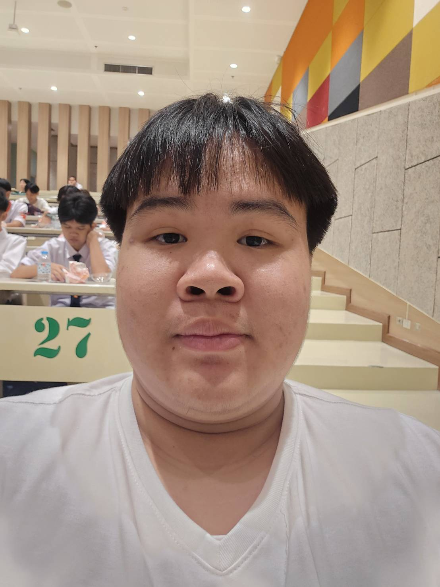

# แนะนำสมาชิกในทีม

## ข้อมูลส่วนตัว

ชื่อ : พงศ์เพชร เพชรอาวุธ / Pongphet Phetarwut

ชื่อเล่น : เพชร / Phet

อายุ : 18 ปี

### งานอดิเรก

* ชอบเล่นเกมมาก ๆ โดยเฉพาะเกมที่ได้เล่นกับเพื่อน เพราะรู้สึกว่าสนุกกว่าการเล่นคนเดียว เกมที่เล่นบ่อยก็จะมีพวก Roblox หรือเกมแนวต่อสู้กับเกมที่ต้องใช้ความคิดและฝีมือ บางทีก็เล่นเพลินจนรู้ตัวอีกทีก็ผ่านไปหลายชั่วโมงแล้ว 4546454545454655145

* จริง ๆ ก็ชอบดูอนิเมะกับฟังเพลงเหมือนกัน โดยเฉพาะอนิเมะแนวโรแมนติกกับแนวต่อสู้พวก โช เน็นอะไรงี้หรือเรื่องที่มีเนื้อเรื่องให้ติดตาม เพราะดูแล้วอินกับตัวละครได้ง่าย ส่วนเพลงก็ฟังหลายแนวตามอารมณ์ บางวันก็เปิด K pop บางวันก็เพลง ญี่ปุ่น ไทย สากล แล้วแต่อารมณ์ ตอนเล่นเกมหรือทำงาน ทำให้รู้สึกว่ามีอะไรเปิดคลอไว้แล้วทำอะไรเพลินขึ้น

* อีกอย่างที่ชอบคือฟุตบอล ถึงจะไม่ได้เล่นจริงจังตลอด แต่ชอบดูและสนใจเรื่องนักฟุตบอล เทคนิคการเล่น รวมถึงชอบลองฝึกทักษะต่าง ๆ เอง เพราะรู้สึกว่าเวลาทำได้ดีขึ้นมันค่อนข้างสะใจดี

### อะไรเป็นสิ่งที่ทำให้รู้สึกมีความสุขหรือผ่อนคลายเวลาที่เรียนเหนื่อย ๆ
* เวลาได้กลับมาถึงห้องแล้วได้นอนเล่นหรือนั่งเล่นอะไรของตัวเองสักพักหลังจากเรียนมาทั้งวันมันเหมือนได้ตัดขาดจากเรื่องเรียนไปเลย แล้วส่วนตัวก็ชอบการเล่นเกม ดู YouTube หรือดูอนิเมะอะไรที่เราชอบ เพราะมันทำให้ไม่ต้องคิดเรื่องงานหรือเรื่องเรียนสักพัก แล้วถ้าวันไหนเหนื่อยมากจริง ๆ เราว่าการได้นอนแบบไม่ต้องตั้งใจทำอะไรเลยก็น่าจะเป็นสิ่งที่ช่วยได้ดีที่สุด เพราะบางทีไม่ได้ต้องการอะไรเยอะ แค่อยากให้สมองได้พักจากทุกอย่างสักแป๊บก็พอและก็ ชาเย็น สักแก้วแค่นี้ก็สบายแล้วว

### มีเหตุการณ์อะไรตั้งแต่เข้ามหาวิทยาลัยที่ทำให้รู้สึกประทับใจไหม
* เหตุการณ์ที่ประทับใจที่สุดคงเป็นได้พบแก๊งเพื่อนที่คุยกันถูกคอมากกคิดว่าน่าจะคบกันไปจนจบเลยยแต่ละคนพาไปเปิดโลกมากกกละก็ กิจกรรม IT Starter Pack 32 ได้รุ้จักรุ่นพี่หลายๆคนเลยละหนึ่งในนั้นคือสนิทกันมากกประทับใจที่มีเพื่อนหลายๆคนเลยยไม่คิดว่าจะปรับตัวได้ไวขนาดนี้โดยรวมประทับใจมากกก

_ _ _ _ _ _ _ _ _ _ _ _
ช่องทางการติดต่อ : [IG - 
x9_qxick](https://www.instagram.com/x9_qxick/)

ชื่อ ศุภณัฐ เพชรแท้ (Suppanat Phetthae)

ชื่อเล่น โบนัส (Bonus)

อายุ 18

### งานอดิเรก 
-ชอบอ่านบทความเรื่องเทคโนโลยีใหม่ๆ / ฟัง Podcast การเงิน / เล่นบาสเกตบอล

### ช่วงนี้เวลาส่วนใหญ่ในแต่ละวันหมดไปกับเรื่องอะไร เล่าให้ฟังหน่อยได้ไหม
-ช่วงนี้ใช้เวลาส่วนใหญ่ไปกับการปรับตัวเรื่องการเรียน ต้องตื่นตัวและขยันขึ้นกว่าเดิมเยอะ ทั้งการกลับมาทำสรุปทบทวนและเคลียร์งานในแต่ละวัน เพราะเนื้อหาไปไวมาก บางวันเลยต้องใช้เวลาจัดการตารางชีวิตหลังเลิกเรียนใหม่หมดเพื่อไม่ให้งานค้าง

### การปรับตัวเรื่องเพื่อนหรือสังคมเป็นยังไงบ้าง เล่าให้ฟังหน่อย
-ปรับตัวได้ค่อนข้างดี เพราะเป็นคนเข้ากับคนง่ายและเปิดรับเพื่อนใหม่อยู่แล้ว พอเจอคนที่คุยถูกคอ มีไลฟ์สไตล์ใกล้กัน ก็ช่วยกันเรียน ช่วยกันแชร์ข้อมูลวิชาต่างๆ ได้ดี ทำให้ไม่รู้สึกโดดเดี่ยวในการเริ่มต้นใหม่

### ตั้งแต่เข้ามาเรียนมหาลัย มีอะไรที่รู้สึกว่าต่างจากที่คิดไว้ตอนแรกบ้างไหม
-ต่างจากตอนมัธยมชัดเจนมาก โดยเฉพาะเรื่องวิชากับความอิสระ ตอนแรกคิดว่าจะชิลกว่านี้ แต่พอไม่มีใครมาคอยตามงานหรือจี้เรื่องอ่านหนังสือเหมือนเดิม อิสระตรงนี้เลยกลายเป็นว่าเราต้องมีวินัยและรับผิดชอบตัวเองแบบ 100% เต็มที่

ช่องทางการติดต่อ : [IG - bon.usok] (https://www.instagram.com/bon.usok/)

ชื่อ : สุดารัตน์ สวนยิ้ม / Sudarat Suanyim

ชื่อเล่น : อัยมี่ / Imi

* ชอบฟังเพลงมาก ๆ ฟังได้ทั้งวันเลย ทุกแนวเลยด้วย จนบางทีก็ปวดหูจนต้องหยุดใช้หูฟังไปบ้าง แต่ชอบเป็นพิเศษก็จะพวกเพลงที่เศร้า ๆ เพราะรู้สึกว่าสื่ออารมณ์ได้ดี ,จริง ๆ ก็ชอบอ่านหนังสือทุกแนวเลย แต่ถ้าที่อ่านหรือซื้อบ่อยก็จะเป็นพวกนิยาย หลัก ๆ คือ แฟนตาซี, โรแมนติก-คอมมาดี้, สืบสวน หรือ ปริศนา เพราะอ่านแล้วอินกว่าประเภทอื่น

### อะไรเป็นสิ่งที่ทำให้รู้สึกมีความสุขหรือผ่อนคลายเวลาที่เรียนเหนื่อย ๆ
* ก็คงเป็นเวลาเรียนเสร็จแล้วได้นอนพักใส่หูฟัง ฟังเพลงกับตัวเองอะไรประมาณนั้นแหละ เพราะแค่รู้สึกว่าหลาย ๆ ครั้ง การฟังเพลงมันก็ช่วยฮีลเราได้ดีกว่าอะไรหลายอย่าง แล้วก็คงเป็นพวกของหวานเติมน้ำตาลเข้าเลือดนะ โดยเฉพาะน้ำหวาน หรือ ช็อคโกแลต คือแค่เห็นก็รู้สึกว่าอารมณ์ดีเลย 55555 แต่ที่จริงเราชอบของหวานทุกอย่างเลยนะ ส่วนถ้านอกเหนือจากนี้เรารู้สึกว่าบางวันที่เหนื่อยมากเกินไป บางทีอาจจะแค่อยากร้องไห้ระบายกับตัวเอง หรือคนที่ไว้ใจจนกว่าจะดีขึ้นแค่นั้นก็ได้ หลายครั้งที่ทำก็รู้สึกดีขึ้นจริง ๆ นะ แต่ก็จะปวดตาหน่อยพอรู้ตัว

### มีเหตุการณ์อะไรตั้งแต่เข้ามหาวิทยาลัยที่ทำให้รู้สึกประทับใจไหม
* เหตุการณ์ที่ประทับใจที่สุดตอนนี้คงเป็นตอนที่เข้าค่าย IT Starter Pack 32 ตอนที่ได้ทำกิจกรรมกับทุกคนครั้งแรกยันวันนี้เลย เพราะก่อนหน้านี้ก็กลัวการปรับตัวกับสังคมระดับนึงเลย เราไม่ค่อยรู้วิธีเข้าหาคนอื่น กลัวสายตาคนจะมองว่าเราหยิ่งหรือเปล่า แต่เพราะได้คุยกับเพื่อน กับรุ่นพี่ทุกคน ตอนที่มีหลาย ๆ คนเข้ามาคุยด้วยก็เลยรู้สึกขอบคุณแล้วก็ประทับใจมาก ๆ ไม่รู้ว่ามันดูละเอียดอ่อนไปไหมแต่มันทำให้เราประทับใจแล้วก็สบายใจกับการอยู่ตรงนี้มาก ๆ รู้สึกเหมือนได้อยู่ในที่ที่เป็นของตัวเองอะไรแบบนั้น

_ _ _ _ _ _ _ _ _ _ _ _
ช่องทางการติดต่อ : [IG - ir2p.wf](https://www.instagram.com/ir2p.wf?igsh=MXBmZHlvZnYxcGxpMQ%3D%3D&utm_source=qr)

## ข้อมูลส่วนตัว

**ชื่อ:** ภราดร เหมพิจิตร (Paradorn Hempichit)
**ชื่อเล่น:** บอล (Ball)
**อายุ:** 18 ปี

## งานอดิเรก

- การออกกำลังกาย เน้นดูแลสุขภาพเพื่อให้ร่างกายแข็งแรง
- ฟังเพลงหรือดูคลิปวิดีโอต่าง ๆ เพื่อผ่อนคลาย
- เล่นเกมเพื่อความสนุกและฝึกทักษะต่าง ๆ

## เป้าหมายในชีวิต

- การเรียนจบในมหาลัยก่อน แต่พอจบจะได้ทำงานตรงสายไหมก็คืออีกเรื่องหนึ่ง อยากทำงานหรือการหาเงินที่สามารถหาเลี้ยงครอบครัวและตัวเองได้

## ลักษณะบุคลิกของตัวเอง

- เป็นคนเงียบๆ(introvert) แต่ความจริงจะเป็นคนพูดมาก ถ้าได้อยู่กับเพื่อนที่สนิทมากๆแล้ว 

## ช่องทางการติดต่อ 📱

- Instagram: [@ballbzx](https://www.instagram.com/ballbzx?igsh=Z3RsMXIwbzlvaDJx&utm_source=qr)
# แนะนำสมาชิกในทีม

## ข้อมูลส่วนตัว

ชื่อ : กนกวรรณ ห้วยหงษ์ทอง (Kanokwan Hoyhongthong)
ชื่อเล่น : มุก (Mook)
อายุ : 18 ปี
### งานอดิเรก 
- ชอบเล่นเกมแนวต่อสู้แบบFreefire แล้วก็เล่นชิวๆ พวกมายคราฟ คุกกี้รัน /ฟังเพลง
### ช่วงนี้ชีวิตในมหาวิทยาลัยเป็นอย่างไรบ้าง
- เปิดมาแล้ว 2 อาทิตย์ ก็ยังไม่ชินเท่าไหร่ ยังปรับตัวไม่ค่อยได้ โดยเฉพาะเรื่องเรียน มันไม่เหมือนกับมัธยมเลย แล้วยิ่งอยู่หอไม่ได้อยู่บ้าน พอเลิกเรียนกลับหอ ก็เหงาๆ คิดถึงบ้านมากกก ช่วงนี้ก็มีเครียดเรื่องคิดถึงบ้านนี่แหละ แต่คิดว่าเดี๋ยวจะเริ่มไม่มีเวลาคิดเรื่องอื่นละ นอกจากเรื่องงาน งานเย๊ออเยอะ ต้องรับผิดชอบเอาอ่ะ ไม่ได้มีใครคอยทวงแล้ว โดยรวมชีวิตช่วงนี้ในมหาลัยก็ไม่ค่อยโอเท่าไหร่

### อะไรคือสิ่งที่ทำให้คุณตัดสินใจเลือกเรียนสาขานี้
- ตอนแรกไม่เคยคิดจะเรียนสายนี้เลย เค้าเรียนสายวิทย์-คณิตมา ตอนจะสอบเข้าอ่ะ จะเข้าสายสุขภาพด้วยซ้ำ เทคนิคการแพทย์ รังสีเทคนิคงี้ แต่่พอเรียนๆเนื้อหาไป ก็รู้สึกไม่ชอบวิชาเคมี กับชีวะ เลยรู้ละว่าไปไม่รอดแน่่สายสุขภาพ แต่่ก็ยังไม่ได้คิดเปลี่ยนสายหรอก เรียนมาเรื่อยๆ จนใกล้จะสอบเข้ามหาลัยละ ตอนครูให้ทำพอร์ตส่งอ่ะ ก็ทำส่งของรังสีเทคนิคไป แต่่เวลาเขียนพวกแรงบันดาลใจในการเข้าหรือพวก SOP อ่ะมันเขียนไม่ได้เลยเพราะไม่ได้ชอบขนาดนั้น 
เลยเริ่มกลับมาคิดละว่าสรุปจะเข้าอะไรดี คิดในใจไว้แล้วว่าสายสุขภาพอ่ะไว้ก่อน ทีนี้เค้าชอบเล่นเกม ก็หาคณะที่น่าจะทำอะไรเกี่ยวกับเกมได้  มาเจอพวกสายวิศวะ IT แต่รู้ตัวว่าวิศวะไม่น่าไหว เลยเลือก IT มา ไม่ได้หาข้อมูลละเอียดขนาดนั้น รู้ว่ามีเขียนโค้ด แต่่ไม่คิดว่าจะเยอะ เลยเลือกเข้ามา

### อะไรเป็นสิ่งที่ทำให้มีความสุขหรือผ่อนคลายเวลาที่เรียนเหนื่อยๆ
- ถ้าเป็นช่วงนี้คือได้โทรหาแม่แบบเห็นหน้าอ่ะ เพราะเค้าอยู่หอ พอได้เห็นหน้าแม่ก็เหมือนได้อยู่บ้าน ได้เล่าให้แม่ฟังว่าเรียนอะไรมาบ้าง เจออะไรมา กินอะไรวันนี้ ก็เล่าไปมันคลายเครียดได้จริงๆ แต่ถ้าแม่ไม่ว่าง ก็จะดูติ้กต้อก ดูเขาไลฟ์สตรีมเกมฟีฟายเอาสนุกดี ฟังเพลงบ้างไรบ้าง เพราะไม่อยากนอนเฉยๆ พอได้ดูหรือทำอะไรที่ชอบ ก็หายเครียดได้จริง

ช่องทางการติดต่อ : [IG - maokancha_kk] (https://www.instagram.com/maokancha_kk?igsh=MTVrdTF4a3pkdHhldA%3D%3D&utm_source=qr)

# แนะนำสมาชิกในทีม

## ข้อมูลส่วนตัว

ชื่อ : ภีรพัฒน์ ภัทรพัฒนศิริกุล / Peerapat Pattarapattanasirikul

ชื่อเล่น : พี / Pe

อายุ : 18 ปี

### งานอดิเรก
* งานอดิเรกของฉันมีหลายอย่าง เช่น เล่นเกม ดูหนัง ออกกำลังกาย และทำอาหาร เวลาว่างส่วนใหญ่ฉันชอบเล่นเกม เพราะเป็นกิจกรรมที่ช่วยผ่อนคลายและได้สนุกกับเพื่อน ๆ ส่วนการดูหนังก็เป็นอีกอย่างที่ชอบ โดยสามารถดูได้หลายแนว แต่จะชอบหนังที่มีเนื้อเรื่องน่าติดตามหรือมีปริศนาให้คิดตาม นอกจากนี้ยังชอบออกกำลังกาย เพราะรู้สึกว่าได้ดูแลสุขภาพและช่วยให้ร่างกายแข็งแรงขึ้น ส่วนเวลาที่อยากทำอะไรที่แตกต่างออกไปก็จะลองทำอาหาร โดยชอบลองทำเมนูใหม่ ๆ หรือปรับสูตรต่าง ๆ ให้เป็นแบบที่ตัวเองชอบ เพราะรู้สึกสนุกและภูมิใจเวลาทำออกมาแล้วกินได้จริง ๆ

### อะไรเป็นสิ่งที่ทำให้รู้สึกมีความสุขหรือผ่อนคลายเวลาที่เรียนเหนื่อย ๆ
* สิ่งที่ทำให้ฉันรู้สึกมีความสุขหรือผ่อนคลายเวลาเรียนเหนื่อย ๆ คือการได้ทำสิ่งที่ตัวเองชอบ เช่น เล่นเกม ดูหนัง ฟังเพลง หรือออกไปออกกำลังกาย เพราะช่วยให้ได้พักจากเรื่องเรียนและไม่ต้องคิดถึงงานหรือการบ้านสักพัก นอกจากนี้การได้กินของอร่อย ๆ หรือทำอาหารเองก็ช่วยให้รู้สึกดีขึ้นเหมือนกัน โดยเฉพาะเวลาที่เรียนหรือทำงานมาหนัก ๆ แล้วได้กลับมาทำกิจกรรมที่ชอบ จะช่วยให้รู้สึกสบายใจและมีแรงกลับไปทำสิ่งต่าง ๆ ต่อได้มากขึ้น

### มีเหตุการณ์อะไรตั้งแต่เข้ามหาวิทยาลัยที่ทำให้รู้สึกประทับใจไหม
 
* มีเหตุการณ์ที่รู้สึกประทับใจตั้งแต่เข้ามหาวิทยาลัยอยู่หลายอย่าง แต่สิ่งที่ประทับใจมากที่สุดคือการได้รู้จักเพื่อนใหม่และได้ทำกิจกรรมร่วมกันในช่วงแรก ๆ ที่เข้ามหาวิทยาลัย ตอนแรกยอมรับว่ารู้สึกกังวลและค่อนข้างเกร็ง เพราะต้องมาเจอสังคมใหม่และคนที่ไม่เคยรู้จักมาก่อน ทำให้ไม่แน่ใจว่าจะสามารถเข้ากับเพื่อนได้หรือเปล่า แต่พอได้เริ่มพูดคุย ทำงานกลุ่ม และทำกิจกรรมต่าง ๆ ด้วยกัน ก็รู้สึกว่าเพื่อน ๆ เป็นกันเองและช่วยเหลือกันดี ทำให้ค่อย ๆ กล้าพูดคุยและสนิทกับเพื่อนมากขึ้น

_ _ _ _ _ _ _ _ _ _ _ _
ช่องทางการติดต่อ : [IG - Pxlyrays](https://www.instagram.com/pxlyrays?igsh=MTRxNzMyM2tsbHQ4Mg==)

